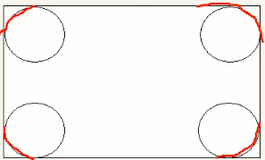

# CSS

## 1.简介

### 1.1 代码风格

以下代码书写风格不是强制规范，而是符合实际开发的书写方式。

+ 算了 格式化工具都能解决这些问题

## 2.基础选择器

### 2.1 选择器的作用

选择器（选择符)就是根据不同需求把不同的标签选出来，这就是选择器的作用。简单来说就是--选择标签用的


### 2.2 选择器的分类

选择器分为 基础选择器 和 复合选择器，先说 基础选择器

+ 基础选择器是由单个选择器组成的
+ 基础选择器又包括： 标签选择器、类选择器、id选择器和通配符选择器


### 2.3 标签选择器

标签选择器（元素选择器）是指用 **HTML标签名称** 作为选择器，按标签名分类，为页面中某一类标签指定同意的CSS样式。

优点：能快速为页面同类型的标签统一设置样式

缺点：不能设计差异化样式，只能选择全部的当前标签。


### 2.4 类选择器

如果想要差异化选择不同的标签，单独选一个或者某几个标签，可以使用类选择器。  


+ 多类名：

我们可以给一个标签指定多个类名，从而达到更多的选择目。这些类名都可以选出这个标签。

````html
<div class="red font20">
    亚瑟
</div>
````

(1) 在标签class属性中写 多个类名 

(2) 多个类名中间必须用空格分开

(3) 这个标签就可以分别具有这些类名的样式


作用和使用场景：

1. 可以把一些标签元素相同的样式（公共部分）放到一个类里面
2. 这些标签都可以调用这个公共的类，然后再调用自己独有的类
3. 从而节省CSS代码，统一修改也很方便
4. 多类名选择器在后期布局比较复杂的情况下，还是较多使用的


### 2.5 id选择器

id选择器可以为标有特定id的HTML元素指定特定的样式。

HTML 元素以 **id属性** 来设置id选择器 ，CSS中 id选择器以 ‘#’ 来定义


### 2.6 通配符选择器

在CSS中，通配符选择器使用"*" 定义，它表示选取页面中所有元素（标签）

```css
* {
    属性1: 属性值1;
}
```

+ 通配符选择器不需要调用，自动就给所有元素使用样式

+ 特殊情况下使用，后面讲解使用场景（以下是清楚所有元素标签的内外边距，后期讲）

````css
* {
    margin:0;
    padding:0;
}
````


## 3. CSS字体属性

### 3.1 字体系列

使用`font-family`属性定义文本的字体系列。

### 3.2 font-weight

100 - 900 九个挡位

### 3.3 font-style

normal ,italic 倾斜的

### 3.5 字体复合属性

````css
font: font-style font-weight font-size/line-height font-family
````

+ 使用font时，要按照上面顺序
+ 不需要设置的属性可以省略（取默认值），但必须保留font size 和font family，**不然不会生效**

## 4.CSS 文本属性

### 4.1 color

color属性用于定义文本颜色。

| 颜色表示     | 属性值           |
| ------------ | ---------------- |
| 预定义颜色值 | red，green，pink |
| 十六进制     | #FF0000 ,#FF6600 |
| RGB代码      | rgb（225，00）   |

### 4.2 对齐文本

text-align 属性用于设置元素内文本内容水平对齐方式

````css
div {
    text-align: center;
}
````

属性值：

| 属性值 | 解释           |
| ------ | -------------- |
| left   | 左对齐（默认） |
| right  | 右对齐         |
| center | 居中对齐       |

### 4.3 装饰文本

text-decoration 属性规定添加到文本的修饰，可以给文本添加下划线、删除线、上划线。 

````css
text-decoration-line: none;
text-decoration-line: underline;
text-decoration-line: overline;
text-decoration-line: line-through;
text-decoration-line: blink;
````

### 4.4 文本缩进

text-indent属性用来指定文本的第一行缩进，通常是将段落**首行**进行缩进。

````css
div {
    text-indent : 10px;
}
````

可以时负值，如果想缩进刚好两个字的长度：

`em`是一个相对单位，就是当前元素（font-size)1个文字的大小，如果当前元素没有设置大小，则会按照父元素的一个文字大小。

 

### 4.5 行间距

line-height属性用来设置行高


行高的改变是改变上下间距，均分

## 5 CSS引入方式

### 5.1 CSS的三种样式表

按照CSS样式书写位置（或引入方式），CSS样式分为三大类

1. 行内样式表（行内式）
2. 内部样式表（嵌入式）
3. 外部样式表（链接式）

### 5.2  内部样式表

内部样式表就是放在html的style标签中

+ `<style>`标签理论上可以放在HTML文档的任何一个地方，但是一般都会放在head标签中

### 5.3 行内样式表

行内样式表（内联样式表）是在元素标签内部的style中设定的css样式。适合于修改简单样式。

+ style 其实就是标签的属性

+ 在双引号中间，写法要复合CSS规范

### 5.4 外部样式表

在实际开发中都是外部样式表。核心是：样式写在单独的CSS文件中，然后引入到HTML页面中。

1. 新建.css的样式文件
2. 在HTML页面中，使用`<link>`标签引入这个文件

````html
<link rel="stylesheet" href="css文件路径">
````


## 6 Emmet语法

### 6.1 Emmet 语法

Emmet语法的前身是Zen coding ，它使用缩写，来提高html/css编写速度，Vscode内部已经集成改语法。

### 6.2快速生成HTML结构语法

1. 生成标签 直接输入标签名 按tab就行，比如输入div 按tab
2. 如果想要生成多个相同的标签，加上*就可以了，比如`div\*3`就可以快速生成三个div
3. 如果由父子级关系的标签，可以用 > 比如 ul > li 就可以了
4. 如果有兄弟关系的标签，用 +就可以了，比如 div + p
5. 如果生成带有类名或id名字的，直接写成.demo 或者#two tab 键就可以了,如果想要生成其他标签比如p，可以加约束：`p.one`
6. 如果生成的div类名是有顺序的，可以用 自增符号 $,`.demo$*5`
7. 如果想要在生成的标签内部些内容可以用{}表示

### 6.3快速生成CSS样式语法

CSS基本采取简写形式即可

1. 比如w200 按tab就可以生成width: 200px
2. 比如 lh26

## 7 CSS 复合选择器

### 7.1 什么是复合选择器

在CSS中，可以根据选择器的类型把选择器分为基础选择器和复合选择器，复合选择器是在基础选择器的基础之上，对基础选择器进行组合形成的。

包括：后代选择器、子选择器、并集选择器、伪类选择器等等。

### 7.2后代选择器（重要）

后代选择器又称为包含选择器，可以选择父元素里面的子元素。其写法就是把外层标签写在前面，内层标签写在后面，中间用空格分隔，当标签发生嵌套时，内层标签就成为外层标签的后代。

````css
元素1 元素2 {样式声明}
````

上述语法表示选择元素1里面所有的元素2（后代元素）

+ 必须用空格隔开
+ 元素2可以是儿子，也可以是孙子，也可以是重孙子

+ 元素一和元素2可以是任意选择器

### 7.3子选择器（重要）

子元素选择器（子选择器） 只能选择作为某元素最近一级子元素，简单理解就是选亲儿子元素。

语法：

````css
元素1 > 元素2 {}
````

上述语法表示选择元素1的所有直接后代（子元素，亲儿子）元素2

### 7.4并集选择器（重要）

并集选择器可以选择多组标签，同时为他们定义相同的样式。通常用于集体声明。

通过英文都好（,)连接而成，任何形式的选择器都可以作为并集一部分

+ 通常用于集体声明

### 7.5 伪类选择器

用于向某些选择器添加特殊的效果，比如给连接添加特殊效果，或者选第一个，第n个元素

伪类选择器最大特点就是用冒号(:)表示，比如:hover、first-child

因为伪类选择器很多，比如链接伪类、结构伪类等等

### 7.6 链接伪类选择器

````css
a:link /*选择所有未被访问的链接*/
a:visited /*选择所有已被访问的链接*/
a:hover /*选择所有鼠标指针位于其上的链接*/
a:active /*选择所有活动的链接（鼠标按下未弹起的链接）*/
````

### 7.7 :focus 伪类选择器

:focus伪类选择器用于选取获得焦点的表单元素

焦点就是光标，一般情况 input 类表单元素才能获取，因此这个选择器主要针对于表单元素。

````css
input:focus{
    background-color: yellow;
}
````

## 8.元素显示模式

### 8.1 什么是元素显示模式

元素显示模式就是元素以什么方式进行显示，比如div自己占一行，一行多个span

HTML元素一般分为**块元素**和**行内元素**两种类型。


### 8.2 块元素

典型 div

块元素特点：

1. 比较霸道，自己独占一行
2. 高度、宽度、外边距和内边距都可以控制
3. 宽度默认是容器（父级宽度）的100%
4. 是一个容器及盒子，里面可以放行或者块级元素

注意：

+ 文字类元素内不能使用块级元素
+ <p》标签主要用于存放文字，因此p里面不能放块，特别是div
+ 同理 h1-h6也是

````html
   <p>
        <div>你好撒比</div>
    </p>

//变成下面这个了

<p>
        </p>
<div>你好撒比</div>
<p></p>
````


### 8.3 行内元素

`<a> <span> <u>` 等等

span是最典型的行内元素，有的地方也叫内联元素。

行内元素的特点：

1. 相邻行内元素在同一行上，可以显示多个
2. 高、宽直接设置是无效的
3. 默认宽度就是他本身的内容的宽度
4. 行内元素只能容纳文本或其他行内元素

注意：

+ 链接里面不能再放链接
+ 特殊情况a里面可以放块，但是给a转一下块级模式最安全

### 8.4 行内块元素

在行内元素中有几个特殊的标签- img,input,td，他们同时具有块元素和行内元素的特点，有些资料称为行内块元素

特点：

1. 和相邻元素在同一行上，但是会有空白缝隙，一行可以显示多个
2. 默认宽度是本身内容的宽度
3. 高度，行高，外边距，内边距都是可以控制

### 8.5 显示模式转换 

特殊情况下，我们需要元素模式转换，简单理解：一个模式的元素需要另外一种模式的特性

比如想要增加链接`<a>`的触发范围

+ 转换成块元素:display: block,inline,inline-block

### 8.6 一个小技巧，单行文字垂直居中

CSS没有给我们提供文字垂直居中的代码，我们可以使用小技巧实现。

解决方案：让文字的行高等于盒子的高度，这样可以让文字在当前盒子垂直居中了

## 9. CSS 背景

### 9.1 background-color

一般情况下元素背景颜色默认值是 `transparent（透明）`


### 9.2 背景图片

优点是非常便于控制位置

````css
background-image: none | url(url);
````


### 9.3 背景平铺

如果要再HTML页面上进行背景平铺，可以使用background-repeat属性

````css
background-repeat: repeat | no-repeat | repeat-x | repeat-y;
````


### 9.4 背景图片位置

利用background-position 属性可以改变图片再背景图片中的位置.

````css
background-position: x y;
````

参数代表的意思是： x坐标和y坐标，可以使用方位名词或者精确单位

| 参数值   | 数明                                               |
| -------- | -------------------------------------------------- |
| length   | 百分数 \| 由浮点数字和单位标识符组成的长度值       |
| position | top \| center \| bottom \| left  \| right 方位名词 |

1. 参数是方位名词

+ 则两个值的前后顺序无关
+ 如果只指定一个方位名词，另一个之省略，则第二个默认居中对齐

2. 参数是数值

+ 如果参数值是精确坐标，那么第一个参数肯定是x坐标，第二个参数一定是y坐标
+ 如果只指定一个数值，那么该数值一定是x坐标，另一个默认垂直居中

3. 混合单位

+ 如果指定的两个值一个是精确单位一个是方位名词，则第一个为x坐标，第二个为y坐标


### 9.5 背景图像图定（背景附着）

background-attachment 属性设置背景图像是否固定或者随着页面其余部分滚动

````css
background-attachment: scroll | fixed
````


### 9.6 背景复合写法

此属性是一个 [简写属性](https://developer.mozilla.org/zh-CN/docs/Web/CSS/Shorthand_properties)，可以在一次声明中定义一个或多个属性：[`background-clip`](https://developer.mozilla.org/zh-CN/docs/Web/CSS/background-clip)、[`background-color`](https://developer.mozilla.org/zh-CN/docs/Web/CSS/background-color)、[`background-image`](https://developer.mozilla.org/zh-CN/docs/Web/CSS/background-image)、[`background-origin`](https://developer.mozilla.org/zh-CN/docs/Web/CSS/background-origin)、[`background-position`](https://developer.mozilla.org/zh-CN/docs/Web/CSS/background-position)、[`background-repeat`](https://developer.mozilla.org/zh-CN/docs/Web/CSS/background-repeat)、[`background-size`](https://developer.mozilla.org/zh-CN/docs/Web/CSS/background-size)，和 [`background-attachment`](https://developer.mozilla.org/zh-CN/docs/Web/CSS/background-attachment)。节约代码量。

- `<bg-size>` 只能紧接着 `<position>` 出现，以"/"分割，如： "`center/80%`".
- `<box>` 可能出现 0 次、1 次或 2 次。如果出现 1 次，它同时设定 [`background-origin`](https://developer.mozilla.org/zh-CN/docs/Web/CSS/background-origin) 和 [`background-clip`](https://developer.mozilla.org/zh-CN/docs/Web/CSS/background-clip)。如果出现 2 次，第一次的出现设置 [`background-origin`](https://developer.mozilla.org/zh-CN/docs/Web/CSS/background-origin)，第二次的出现设置 [`background-clip`](https://developer.mozilla.org/zh-CN/docs/Web/CSS/background-clip)。
- `<background-color>` 只能被包含在最后一层。

- **注意:** [`background-color`](https://developer.mozilla.org/zh-CN/docs/Web/CSS/background-color) 只能在background的最后一个属性上定义，因为整个元素只有一种背景颜色。


### 9.7 背景色半透明

CSS3 为我们提供了背景色半透明效果

````css
background: rgba(0,0,0,0.3);
````

+ 最后一个参数是alpha透明度，取值范围0~1
+ 背景色半透明不会对盒子里的内容产生影响
+ CSS3新增特性，是IE9+版本才支持


## 10.CSS 三大特性

CSS 有三个非常重要的特性：层叠性、继承性、优先级。

### 10.1 层叠性

相同选择器设置相同样式，此时一个样式就会覆盖（层叠）另一个冲突的样式。层叠性主要解决样式冲突问题。 

层叠性原则：

+ 样式冲突，遵循的原则是 '就近原则'  ，哪个样式离结构近，就执行哪个样式
+ 样式不冲突不会层叠


### 10.2 继承性

现实中的继承：我们继承了父亲的姓名

CSS中的继承：子标签会继承父标签的某些样式，比如文本颜色和字号。

+ 恰当使用会降低复杂性


#### 行高的继承:

````css
body {
    font: 12px/1.5 Microsoft YaHei;
}
````

+ 行高可以跟单位 ，也可以不跟单位
+ 这个1.5就是当前元素文字大小 font-size的一点五倍 ，如果子元素没有设置行高，则会继承父元素行高1.5
+ body 行高 1.5 这样写法最大优势就是里面 子元素可以根据自己文字大小自动调整行高


### 10.3 优先级

当同一个元素指定多个选择器，就会有优先级的产生

+ 选择器相同，则执行层叠性
+ 选择器不同，则根据 `选择器权重` 执行


选择器权重如下表所示：

| 选择器               | 选择器权重 |
| -------------------- | ---------- |
| 继承 或者 *          | 0,0,0,0    |
| 元素选择器           | 0,0,0,1    |
| 类选择器，伪类选择器 | 0,0,1,0    |
| ID选择器             | 0,1,0,0    |
| 行内选择器style=""   | 1,0,0,0    |
| !important 重要的    | 无限大     |


**优先级注意点：**

1. 权重是由4组数字组成，但是不会有进位
2. 可以理解为类选择器永远大于元素选择器，id选择器永远大于类选择器，以此类推
3. 等级判断从左向右，如果某一位相同，则判断下一位数值


**权重叠加：**如果是复合选择器，则会有权重叠加，需要重新计算权重

+ div ul li -----> 0,0,0,3
+ .nav ul li ----->0,0,1,2
+ a:hover ------> 0,0,1,1
+ .nav a -----> 0,0,1,1


## 11.盒子模型

### 目标：

+ 准确阐述盒子模型4个部分
+ 能够利用边框复合写法给元素加边框
+ 能够计算盒子实际大小
+ 能够利用盒子模型布局模块案例
+ 能够给盒子设置圆角边框
+ 能够给盒子添加阴影
+ 能够给文字添加阴影


### 11.1 盒子模型

页面布局要学习三大核心：盒子模型，浮动 和 定位，学习好盒子模型能非常好的帮助我们布局页面

CSS盒子模型本质上是一个盒子，封装周围的HTML元素，包括：边框、外边距、内边距和实际内容


### 11.2 边框

border-width ,border-style,border-color

### 11.3 表格的细线边框

border-collapse属性控制浏览器绘制表格边框的方式，他控制相邻单元格的边框

+ collapse 单词是合并的意思
+ border-collapse：collapse 的意思是相邻边框合并在一起


### 11.4 边框会影响盒子的实际大小


### 11.5  padding不会撑开盒子的情况

如果盒子本身没有指定width/height属性，则此时padding不会撑开盒子带下哦。只要指定就会改变！！

### 11.6 内边距 padding影响了盒子实际大小

padding内边距可以撑开盒子，我们可以做巧妙的运用

因为每个导航栏里面的数字不一样多，我们可以不用给盒子宽度了，直接给padding最合适


### 11.7 盒子外边距

外边距可以让块级盒子水平居中，但是必须满足两个条件

1. 盒子必须指定宽度
2. 盒子左右外边距都设置为auto


### 11.8 外边距合并

使用margin定义块元素的垂直外边距时，可能会出现外边距合并

#### 1.相邻块元素垂直外边距合并

当上下相邻两个块元素（兄弟关系）相遇时，如果上面的元素有下外边距margin-bottom,下面的元素有margin-top,则他们之间垂直间距不是margin-bottom与margin-top之和。 **取两个值中较大者这种现象称为相邻块元素垂直外边距的合并**

解决方案：**尽量只给一个盒子添加margin值**


#### 2.嵌套块元素垂直外边距塌陷

对于两个嵌套关系（父子关系）的块元素。父元素有margin-top同时子元素也有margin-top，此时父元素会塌陷较大的外边距值


解决方案：

1. 为父元素定义上边框
2. 为父元素定义上内边距
3. 为父元素添加overflow:hidden


### 11.9清除内外边距

网页元素很多都带有默认的内外边距，而且不同浏览器默认值还不同，因此我们在布局前要清除下网页元素内外边距

````css
* {
    padding:0;
    margin:0;
}
````

### 11.10圆角边框（重点）
border-radius: length; 属性用于设置圆角边框

radius半径（圆的半径）原理：**（椭）圆与边框的交集形成圆角效果。**




+ 如果是 正方形， 想要设置为一个圆 ，把数值改成·高度或者宽度的一半即可，或者直接写 50%
+ 如果是矩形，就设置为高度的一半
+ 如果是简写属性，顺序为：左上、右上、右下、左下    
+ 分开写：border-top-left-radius、border-top-right-radius、border-bottom-right-radius、border-bottom-left-radius

### 11.11盒子阴影 
box-shadow 添加阴影
CSS box-shadow 属性用于在元素的框架上添加阴影效果。你可以在同一个元素上设置多个阴影效果，并用逗号将他们分隔开。该属性可设置的值包括阴影的X轴偏移量、Y轴偏移量、模糊半径、扩散半径和颜色。

+ inset
  如果没有指定inset，默认阴影在边框外，即阴影向外扩散。
  使用 inset 关键字会使得阴影落在盒子内部，这样看起来就像是内容被压低了。 此时阴影会在边框之内 (即使是透明边框）、背景之上、内容之下。

+ `<offset-x> <offset-y>`
  这是头两个 <length> 值，用来设置阴影偏移量。x,y 是按照数学二维坐标系来计算的，只不过y垂直方向向下。  <offset-x> 设置水平偏移量，正值阴影则位于元素右边，负值阴影则位于元素左边。 <offset-y> 设置垂直偏移量，正值阴影则位于元素下方，负值阴影则位于元素上方。可用单位请查看 <length> 。
  如果两者都是0，那么阴影位于元素后面。这时如果设置了<blur-radius> 或<spread-radius> 则有模糊效果。需要考虑 inset 

+ `<blur-radius>`

  影子是虚还是实的

  这是第三个 <length> 值。值越大，模糊面积越大，阴影就越大越淡。 不能为负值。默认为0，此时阴影边缘锐利。本规范不包括如何计算模糊半径的精确算法，但是，它详细说明如下：
  对于长而直的阴影边缘，它会创建一个过渡颜色用于模糊 以阴影边缘为中心、模糊半径为半径的局域，过渡颜色的范围在完整的阴影颜色到它最外面的终点的透明之间。 （译者注：对此有兴趣的可以了解下数字图像处理的模糊算法。）

+ `<spread-radius>`

  阴影大小

  这是第四个 <length> 值。取正值时，**阴影扩大**；取负值时，**阴影收缩**。默认为0，此时阴影与元素同样大。需要考虑 inset 

+ `<color>`
相关事项查看 <color> 。如果没有指定，则由浏览器决定——通常是color的值，不过目前Safari取透明。

## 12.CSS 浮动

### 1.1 传统网页布局三种方式

网页布局的本质--用CSS来摆放盒子。把盒子放到相应的位置。

CSS提供了三种布局方式（简单说，就是盒子如何进行排列顺序）

+ 普通流（标准流）
+ 浮动
+ 定位


### 1.2 标准流

所谓的标准流：就是标签按照默认方式排列

1. 块级元素独占一行，从上到下顺序排列

2. 行内元素从左到右排列，碰到父元素边缘会自动换行

以上都是标准流布局。


### 1.3 为什么需要浮动？

有很多种布局效果标准流没有办法完成，此时就可以利用浮动完成布局。因为浮动可以改变元素标签默认的排列方式。

### 1.4 什么是浮动？

float属性用于创建浮动框，将其移到以便，直到左边缘或右边缘触及包含块或另一个浮动框边缘


### 1.5 浮动特性（重难点）

1. 浮动元素会脱离标准流（脱标）
2. 浮动元素会一行显示并且元素 顶部对齐
3. 浮动元素具有行内块元素的特性


设置了浮动（float）的元素最重要的特性：

1. 脱标
2. 浮动的盒子不再保留原先的位置

注意：

+ 浮动的元素互相贴靠在一起，不会有缝隙，如果父级宽度装不下，多出的浮动盒子会另起一行

+ 如果块级盒子没有设置宽度，默认宽度和父级一样宽，但是添加浮动后，它的大小根据内容来决定。
+ 行内元素同理

### 1.6 浮动元素经常和标准流父级搭配使用

为了约束浮动元素位置，网页元素布局策略是：

先用标准流的父元素排列上下位置，之后内部子元素采取浮动排列左右位置。


### 1.7 浮动布局注意点

一个元素浮动了，理论上其余的兄弟也要浮动

浮动盒子只会影响浮动盒子后面的标准流，不会影响前面的标准流


### 1.8 浮动清除

理想状态中，让子盒子撑开父亲，不设置父盒子高度。不给父元素高度也不合适，因为浮动元素不占用位置的

由于父盒子很多情况下不方便给高度，但是子盒子浮动又不占有位置，最后父级盒子高度为0时，就会影响下面的标准流盒子。

+ 由于浮动元素不再占有原文档流的位置，所以它会对后面的元素排版产生影响。


### 1.9 清除浮动的本质

+ 清除浮动的本质就是清除浮动元素造成的影响
+ 如果父盒子本身有高度，则不需要清除浮动
+ 清除浮动之后，父级就会根据浮动的子盒子自动检测高度。父级有了高度，就不会影响下面的标准流了

语法：

````css
clear: 属性值;
````

清除浮动的策略时：闭合浮动


### 1.10 清除浮动方法

1. 额外标签发也称为隔墙法，时W3C推荐的做法。

会在浮动末尾添加一个空的标签，例如 `<div style="clear: both"></div>`，或者其他标签比如`<br>`等。

+ 很方便，但是会添加很多无意义的标签，结构化差

注意： 这个新的比空标签必须是块级元素

2. 父级添加overflow属性

给父级添加这个属性

+ 缺点 ：无法显示溢出部分

3. 父级添加：after为元素

```css
.clear：after {
    content:'';
    display:block;
    height:0;
    clear:both;
    visibility:hidden;
}
```

+ 有点：没有增加标签，结构简单
+ 缺点：照顾低版本浏览器

4. 父级添加双伪元素

````css
.clearfix:before,.clearfix:after {
    content:'';
    display: table;
}
.clearfix:after {
    clear:both;
}
.clearfix {
    *zoom: 1;
}
````

+ 优点 代码更简洁

+ 缺点 照顾低版本

  

##  CSS书写顺序

建议遵循以下顺序：

1. 布局定位属性： display/position/float/clear/visibility/overflow(建议display第一个写，毕竟关系到模式)
2. 自身属性： width/height/margin/padding/border/background
3. 文本属性： color/font/text-decoration/text-align/white-space/break-word
4. 其他css属性（css3）：content/cursor/border-radius/box-shadow/background:linear-gradient....


## 页面布局整体思路

为了提高网页制作效率，布局时通常有以下整体思路：

1. 必须确定页面的版心（可视区），我们测量可知
2. 分析页面中的行模块，以及每个行模块中的列模块，**其实就是页面布局第一准则**
3. 一行中的列模块经常浮动布局，先确定每列大小，之后确定位置。**其实就是页面布局第2准则**
4. 制作HTML结构。我们还是遵循，先有结构，后有样式的原则。结构永远最重要。
5. 所以，先理清楚布局结构，在写代码尤为重要。

## 其他

### px、em、rem、%、vw、vh、vm这些单位的区别？

| 单位 | 说明                                                         | 优缺点                                                       |
| ---- | ------------------------------------------------------------ | ------------------------------------------------------------ |
| px   | px就是pixel的缩写，意为像素。px就是设备或者图片最小的一个点，比如常常听到的电脑像素是1024x768的，表示的是水平方向是1024个像素点，垂直方向是768个像素点。 | 是我们网页设计常用的单位，也是基本单位。通过px可以设置固定的布局或者元素大小，缺点是没有弹性 |
| em   | 参考物是父元素的font-size，具有继承的特点。如果自身定义了font-size，则按自身来计算（浏览器默认字体是16px），整个页面内1em不是一个固定的值。 | 1. em的值并不是固定的； 2. em会继承父级元素的字体大小。      |
| rem  | 是相对于根元素html，这样就意味着，我们只需要在根元素确定一个参考值，可以设计HTML为大小为10px，到时设置1.2rem就是12px.以此类推。 | 优点是，只需要设置根目录的大小就可以把整个页面的成比例的调好。 |
| %    | 一般来说就是相对于父元素的，                                 | 1、对于普通定位元素就是我们理解的父元素 2、对于position: absolute;的元素是相对于已定位的父元素 3、对于position: fixed;的元素是相对于ViewPort（可视窗口）， |
| vw   | css3新单位，view width的简写，是指可视窗口的宽度。假如宽度是1200px的话。那10vw就是120px。 | 举个例子：浏览器宽度1200px, 1 vw = 1200px/100 = 12 px。      |
| vh   | css3新单位，view height的简写，是指可视窗口的高度。假如高度是1200px的话。那10vh就是120px | 举个例子：浏览器高度900px, 1 vh = 900px/100 = 9 px。         |
| vm   | css3新单位，相对于视口的宽度或高度中较小的那个。其中最小的那个被均分为100单位的vm 举个例子：浏览器高度900px，宽度1200px，取最小的浏览器高度，1 vm = 900px/100 = 9 px。 | 兼容性太差 ，现在基本上没人用，我试了一下Chrome就用不了。    |


### -webkit-box-reflect

> This feature is non-standard and is not on a standards track. Do not use it on production sites facing the Web: it will not work for every user. There may also be large incompatibilities between implementations and the behavior may change in the future.
>
> 该特性是非标准的，也不在标准轨道上.不要在面向Web的生产网站上使用它:它不会对每个用户都有效。实现之间也可能存在较大的不兼容性，而且将来行为可能会改变。


### 新知识点：去掉li前面的项目符号（小圆点）

````css
list-style:  none;
````


# [行内块之间存在间隙](https://www.cnblogs.com/yanggeya/p/10553721.html)

现代浏览器中 inline 和 block 元素 display:inline-block 后均会产生水平空隙。 inline 元素默认就有空隙存在！它们是谁？是空白符（white space）

1.写在一行
2.在父元素div上加上 font-size:0
3.使用浮动，input标签的display:block

